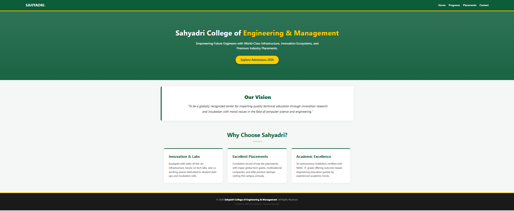

# cloud Lab 1

## Create a Web Server on EC2

1. Launch an EC2 instance on AWS.
2. Connect to it via SSH or EC2 Instance Connect.
3. Create a file named `index.html`.
4. Run:
   ```bash
   sudo yum update ae -y
   sudo yum install httpd -y
   sudo systemctl enable --now httpd
   sudo mv index.html /var/www/html
   sudo systemctl restart httpd
   ```

Then visit the public DNS in your browser:

[ec2-3-83-145-155.compute-1.amazonaws.com](http://ec2-54-90-91-183.compute-1.amazonaws.com/#)




